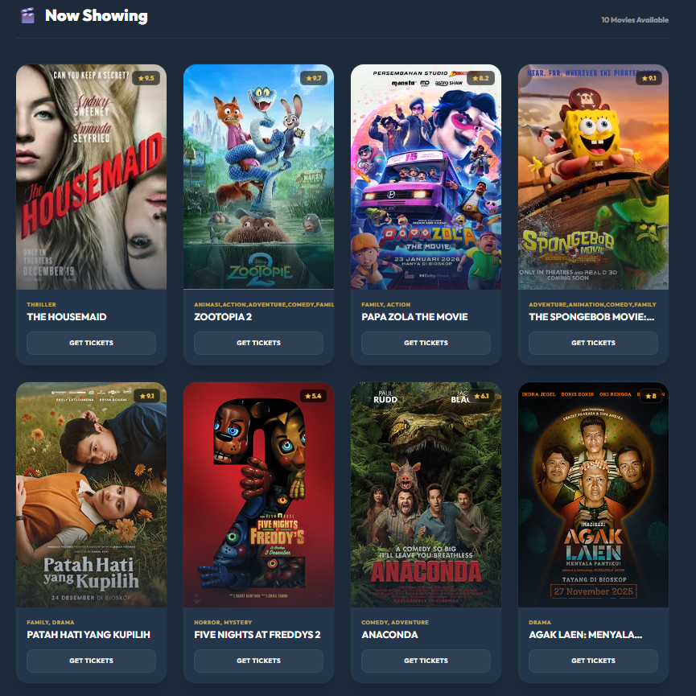

<h1 align="center">
  <br>
  <a href="http://localhost:8000"></a>
  <br>
  MyMupi
  <br>
</h1>

<h4 align="center">A Modern Online Movie Ticket Booking System built with Laravel.</h4>

<p align="center">
  <a href="https://laravel.com/">
    
  </a>
  <a href="https://tailwindcss.com/">
    
  </a>
  <a href="https://www.mysql.com/">
    
  </a>
  <a href="https://alpinejs.dev/">
    
  </a>
</p>

<p align="center">
  <a href="#about">About</a> •
  <a href="#key-features">Features</a> •
  <a href="#screenshots">Screenshots</a> •
  <a href="#installation">Installation</a> •
  <a href="#deployment">Deployment</a> •
  <a href="#authors">Authors</a>
</p>

---

## 🎬 About

**MyMupi** is a web-based application designed to simulate a complete cinema ticket booking experience. Built as a final project for the **Web Programming** course, it adheres to modern web standards and design principles.

The platform provides a seamless flow for users: **Search Movie** → **Select Showtime** → **Choose Seats** → **Payment** → **Get E-Ticket**.

> 🌍 **Note:** The entire User Interface (UI) is in **English** to ensure a professional and consistent global appeal.

---

## ✨ Key Features

### 👤 User (Customer)
*   **Authentication**: Secure Register, Login, and Logout functionality.
*   **Explore Movies**: Browse "Now Showing" and "Coming Soon," search by title, and filter by genre.
*   **Booking System**: Real-time Seat Selection (Cinema map layout), countdowns, and instant E-Ticket generation.
*   **User Dashboard**: View booking history and manage profile.

### 🛡️ Admin (Cinema Manager)
*   **Dashboard**: Overview of cinema operations.
*   **Content Management**: Full CRUD for Movies, Studios, and Showtimes.

---

## 📸 Screenshots

| Landing Page | Movie Detail |
|:---:|:---:|
|  |  |
| **Booking (Seat Selection)** | **Admin Dashboard** |
|  |  |

> *Note: Add screenshots to `public/images/` with the names above to display them here.*

---

## � Folder Structure

A quick look at the project's top-level structure:

```
MyMupi/
├── app/                  # Core application logic (Models, Controllers, Middleware)
├── database/             # Migrations, Seeders, and Factories
├── public/               # Publicly accessible assets (images, css, js)
├── resources/
│   ├── css/              # Tailwind and custom CSS
│   ├── js/               # Alpine.js and scripts
│   └── views/            # Blade templates (Frontend)
├── routes/               # Web and API routing
├── .env                  # Environment variables
└── composer.json         # PHP dependencies
```

---

## 🚀 Installation & Setup (Local)

1.  **Clone the Repository**
    ```bash
    git clone https://github.com/Farmil23/MyMupi.git
    cd MyMupi
    ```

2.  **Install Dependencies**
    ```bash
    composer install
    npm install && npm run dev
    ```

3.  **Environment Setup**
    ```bash
    cp .env.example .env
    php artisan key:generate
    ```
    *Open `.env` and configure your database (DB_DATABASE, DB_USERNAME, etc.).*

4.  **Database Migration**
    ```bash
    php artisan migrate --seed
    ```

5.  **Run Application**
    ```bash
    php artisan serve
    ```

---

## ☁️ Deployment (Vercel + Neon)

This project is optimized for deployment on **Vercel** with a **Neon (PostgreSQL)** database.

1.  **Database**: Create a project on [Neon.tech](https://neon.tech) and get your connection string (Postgres).
2.  **Vercel Project**: Import your GitHub repo to Vercel.
3.  **Environment Variables**: Add the following in Vercel Settings:
    *   `DB_CONNECTION`: `pgsql`
    *   `DB_HOST`, `DB_PORT`, `DB_DATABASE`, `DB_USERNAME`, `DB_PASSWORD`: (From Neon)
    *   `APP_KEY`: (From your local `.env`)
4.  **Migrate on Production**:
    Connect your local terminal to the Neon DB via `.env` temporarily and run `php artisan migrate:fresh --seed`, or use a Vercel Post-Install Command.

---

## 👥 Authors

**Kelompok 7 - Web Programming**

*   **Zeta Mardhotillah Ronny** (152024047)
*   **Farhan Kamil Hermansyah** (152024150)
*   **Ratu Qolbu Maziah** (152024151)

---

## 📝 License

This project is licensed under the **MIT License**.

```
MIT License

Copyright (c) 2024 Kelompok 7

Permission is hereby granted, free of charge, to any person obtaining a copy
of this software and associated documentation files (the "Software"), to deal
in the Software without restriction, including without limitation the rights
to use, copy, modify, merge, publish, distribute, sublicense, and/or sell
copies of the Software, and to permit persons to whom the Software is
furnished to do so, subject to the following conditions:

The above copyright notice and this permission notice shall be included in all
copies or substantial portions of the Software.
```

> Made with ❤️ and ☕ for UAS.
